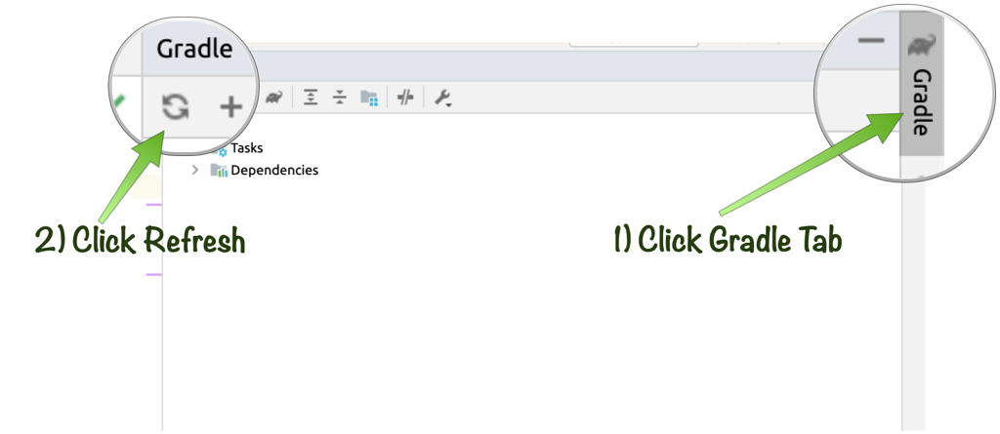

# Setting up your Database Schema with Database Migration & Using Micronaut Data JPA to Simplifiy Data Repositories

## Introduction
In this lab you will learn how your Micronaut application can manage the evolution of your database schema with Flyway and define Data access repository interfaces that simplify your database access code using JPA.

Estimated Lab Time: 25 minutes

### Objectives

In this lab you will:
* Learn how to setup a JDBC connection
* Learn how to configure Flyway
* Understand the benefits of database migration
* Write a SQL schema that will initialize autonomous database
* Learn how to write repository interfaces
* Query the database with the repository interfaces
* Learn how to write custom JPA-QL queries

### Prerequisites

- Access to your project instance
- Basic knowledge of SQL
- Basic knowledge of JPA and JPA-QL

## Configuring Access to Oracle Autonomous Database

Let's now configure access to [Oracle Autonomous Database](https://www.oracle.com/autonomous-database/) to store data.

First, if you are using Gradle add the following dependencies to the `build.gradle` file in the root of your project inside the `dependencies` block:

    <copy>
    runtimeOnly("io.micronaut.sql:micronaut-jdbc-hikari")
    runtimeOnly("com.oracle.database.jdbc:ojdbc8")
    runtimeOnly("com.oracle.database.security:oraclepki:19.8.0.0")
    runtimeOnly("com.oracle.database.security:osdt_cert:19.8.0.0")
    runtimeOnly("com.oracle.database.security:osdt_core:19.8.0.0")
    </copy>

Alternatively if you are using Maven, add the following dependencies to your `pom.xml` inside the `<dependencies>` element:

    <copy>
    <dependency>
      <groupId>io.micronaut.sql</groupId>
      <artifactId>micronaut-jdbc-hikari</artifactId>
      <scope>compile</scope>
    </dependency>
    <dependency>
        <groupId>com.oracle.database.jdbc</groupId>
        <artifactId>ojdbc8</artifactId>
        <scope>runtime</scope>
    </dependency>
    <dependency>
        <groupId>com.oracle.database.security</groupId>
        <artifactId>oraclepki</artifactId>
        <version>19.8.0.0</version>
        <scope>runtime</scope>
    </dependency>
    <dependency>
        <groupId>com.oracle.database.security</groupId>
        <artifactId>osdt_cert</artifactId>
        <version>19.8.0.0</version>
        <scope>runtime</scope>
    </dependency>
    <dependency>
        <groupId>com.oracle.database.security</groupId>
        <artifactId>osdt_core</artifactId>
        <version>19.8.0.0</version>
        <scope>runtime</scope>
    </dependency>
    </copy>

The above configuration adds the Oracle JDBC driver and support for JDBC in Micronaut via the Hikari Connection Pool.

In order to connect to Autonomous Database you typically need to download a [Wallet definition](https://docs.oracle.com/en/cloud/paas/atp-cloud/atpug/wallet-rotate.html#GUID-F0995A6A-78BD-4C9D-9A34-B970BD152CAD) in order to establish a secure connetion.

In this virtual lab the wallet file is already downloaded and extracted to the `/tmp/wallet` directory and the necessary `TNS_ADMIN` environment variable is set, so all that is required is to correctly configure JDBC connectivity. You can do this by modifying the `src/main/resources/application.yml` configuration file with the following settings:

    <copy>
    micronaut:
      application:
        name: demo
      executors:
        io:
          type: fixed
          n-threads: 75
      server:
        thread-selection: IO
    datasources:
      default:
        url: "jdbc:oracle:thin:@${DB_NAME}"
        driverClassName: oracle.jdbc.OracleDriver
        databaseName: "${DB_SCHEMA}"
        username: "${DB_USER}"
        password: "${DB_PASSWORD}"
        dialect: ORACLE
        data-source-properties:
          oracle:
            jdbc:
              fanEnabled: false
    </copy>

> In addition to the database configuration described below, this configuration also sets `micronaut.server.thread-selection` to `IO`, which tells Micronaut to run all server operations on the I/O thread pool. This is important since the application will be doing primarily blocking operations via JDBC and the underlying server (Netty) is based on an event-loop model. The I/O executor is also configured to occupy 75 threads. This may be adjusted according to your production server.

Within the virtual environment of the lab the following environment variables exist:

* `DB_NAME` - the database name
* `DB_SCHEMA` - the database schema
* `DB_USERNAME` - the database username
* `DB_PASSWORD` - the database password

In the `datasources` configuration we use the ability to specify `${..}` expressions to reference these environment variables within the configuration and appropriately configure the [datasource properties](https://micronaut-projects.github.io/micronaut-sql/latest/guide/configurationreference.html#io.micronaut.configuration.jdbc.hikari.DatasourceConfiguration).

The above configuration configures the "default" datasource to connect to Autonomous database and exposes a `javax.sql.DataSource` bean that can be dependency-injected into your application's classes.

## Configuring Flyway

Once you have configured the `DataSource`, add a dependency on `micronaut-flyway` to your `build.gradle` configuration inside the `dependencies` block:

    <copy>
    runtimeOnly("io.micronaut.flyway:micronaut-flyway")
    </copy>

or if using Maven, add to your `pom.xml` under `<dependencies>`:

    <copy>
    <dependency>
        <groupId>io.micronaut.flyway</groupId>
        <artifactId>micronaut-flyway</artifactId>
        <scope>runtime</scope>
    </dependency>
    </copy>

This enables support for the Open Source [Flyway database migration toolkit](https://flywaydb.org) which lets you define SQL scripts that manage and version your database schema so you can gradually evolve the schema along with new versions of your application.

To enable Flyway to run on startup, add the following configuration to your `application.yml`:

    <copy>
    flyway:
      datasources:
        default:
          enabled: true
    </copy>

In addition create a new file called `src/main/resources/application-test.yml` which will contain your test configuration and set Flyway to clean the schema when the application starts, to ensure tests run with fresh data:

    <copy>
    flyway:
      datasources:
        default:
          clean-schema: true
    </copy>

> Note that in a real world scenario you would setup a separate database to run your tests against

## Defining a SQL Migration Script

The next step is to define a SQL migration script that will create the application's initial schema. To do that create a new SQL script in a file called `src/main/resources/db/migration/V1__create-schema.sql` and add the following SQL:

    <copy>
    CREATE TABLE owner (id NUMBER GENERATED ALWAYS AS IDENTITY PRIMARY KEY, name VARCHAR(255) NOT NULL, age NUMBER(2) NOT NULL);
    CREATE TABLE pet (id NUMBER GENERATED ALWAYS AS IDENTITY PRIMARY KEY, name VARCHAR(255) NOT NULL, health VARCHAR(20) NOT NULL, owner_id NUMBER NOT NULL);
    </copy>

The SQL above will create `owner` and `pet` tables to store data for owners and their pets in Autonomous Database.

Before running your application make sure you refresh your Gradle or Maven dependencies:

Try run your application now and it should start successfully and run the migration scripts.

## Configuring Micronaut Data JPA

To configure Micronaut Data JPA, add the following dependencies to your `build.gradle` file's `dependencies` block:

    <copy>
    annotationProcessor("io.micronaut.data:micronaut-data-processor")
    implementation("io.micronaut.data:micronaut-data-hibernate-jpa")
    </copy>

Or if you are using Maven, first add the `micronaut-data-jpa` dependency under `<dependencies>`:

    <copy>
    <dependency>
        <groupId>io.micronaut.data</groupId>
        <artifactId>micronaut-data-hibernate-jpa</artifactId>
        <scope>compile</scope>
    </dependency>
    </copy>

Then add `micronaut-data-processor` under `<annotationProcessorPaths>`:

    <copy>
    <path>
      <groupId>io.micronaut.data</groupId>
      <artifactId>micronaut-data-processor</artifactId>
      <version>${micronaut.data.version}</version>
    </path>
    </copy>

Before proceeding you should refresh your project dependencies:

Now add the following configuration to your `src/main/resources/application.yml` file:

    <copy>
    jpa:
      default:
        entity-scan:
          enabled: true
    </copy>

This enables the lookup of entities from metadata produced at compilation time (avoiding a full classpath scan).

## Mapping Entities to Database Tables

To map entities to the underlying databse tables, simply define classes that match the table names (the default convention is underscore-separated lowercase, but this is configurable) and annotate them with `javax.persistence.Entity`.

For example try and alter the existing `Owner` class as follows:

    <copy>
    package example.micronaut;

    import javax.persistence.Entity;
    import javax.persistence.GeneratedValue;
    import javax.persistence.GenerationType;
    import javax.persistence.Id;
    import javax.validation.constraints.Min;
    import javax.validation.constraints.NotBlank;

    @Entity
    public class Owner {

        @Id
        @GeneratedValue(strategy = GenerationType.IDENTITY)
        private Long id;

        @NotBlank
        private String name;

        @Min(18)
        private int age;

        public Owner() {
        }

        public Owner(String name, int age) {
            this.name = name;
            this.age = age;
        }

        public void setName(String name) {
            this.name = name;
        }

        public void setAge(int age) {
            this.age = age;
        }

        public String getName() {
            return name;
        }

        public int getAge() {
            return age;
        }

        public Long getId() {
            return id;
        }

        public void setId(Long id) {
            this.id = id;
        }
    }
    </copy>

> NOTE: Hibernate/JPA requires a public no-args constructor and getters/setters for each property. You will need to correct the compilation errors in your project as a result of removing the constructor.

Now create a new class that represents the `Pet` entity in a file called `src/main/java/example/micronaut/Pet.java`:

    <copy>
    package example.micronaut;

    import edu.umd.cs.findbugs.annotations.NonNull;

    import javax.persistence.Entity;
    import javax.persistence.GeneratedValue;
    import javax.persistence.GenerationType;
    import javax.persistence.Id;
    import javax.persistence.ManyToOne;

    @Entity
    public class Pet {

        @Id
        @GeneratedValue(strategy = GenerationType.IDENTITY)
        private Long id;

        private String name;

        @ManyToOne
        private Owner owner;

        private PetHealth health = PetHealth.VACCINATED;

        public Pet() {
        }

        public Pet(String name, @NonNull Owner owner) {
            this.name = name;
            this.owner = owner;
        }

        public void setName(String name) {
            this.name = name;
        }

        public void setOwner(Owner owner) {
            this.owner = owner;
        }

        public Owner getOwner() {
            return owner;
        }

        public String getName() {
            return name;
        }

        public Long getId() {
            return id;
        }

        public void setId(Long id) {
            this.id = id;
        }

        public PetHealth getHealth() {
            return health;
        }

        public void setHealth(PetHealth health) {
            this.health = health;
        }

        public enum PetHealth {
            VACCINATED,
            REQUIRES_VACCINATION
        }
    }
    </copy>

The `Pet` class maps to the `pet` table and includes a `@ManyToOne` relationship to the `Owner`. An `enum` is used to represent the health of the `Pet`.

## Defining Repository Interfaces

The next step is to define data access repository interfaces. First define an `OwnerRepository` in a file called `src/main/java/example/micronaut/OwnerRepository.java`:

    <copy>
    package example.micronaut;

    import edu.umd.cs.findbugs.annotations.NonNull;
    import io.micronaut.data.annotation.Repository;
    import io.micronaut.data.repository.CrudRepository;

    import java.util.Collection;

    @Repository
    public interface OwnerRepository extends CrudRepository<Owner, Long> {
        @NonNull
        @Override
        Collection<Owner> findAll();
    }
    </copy>

The `@Repository` annotation designates this interface as a data access repository.

Define another repository interface to manage instances of `Pet` in a file called `src/main/java/example/micronaut/PetRepository.java`:

    <copy>
    package example.micronaut;

    import io.micronaut.data.annotation.Repository;
    import io.micronaut.data.repository.CrudRepository;

    @Repository
    public interface PetRepository extends CrudRepository<Pet, Long> {
    }
    </copy>

Both of these repository interfaces extend from [CrudRepository](https://micronaut-projects.github.io/micronaut-data/latest/api/io/micronaut/data/repository/CrudRepository.html) which contains methods to perform Create, Read, Update and Delete operations.

## Writing Data

To see these in action, let's first modify the `OwnerConfiguration` and add a `pets` property to model each pet an initial `Owner` can have:

    <copy>
    private List<String> pets = Collections.emptyList();

    public List<String> getPets() {
        return pets;
    }

    public void setPets(List<String> pets) {
        this.pets = pets;
    }
    </copy>

You'll also need these imports:

    <copy>
    import java.util.Collections;
    import java.util.List;
    </copy>

Now modify `application.yml` to include some pets for each initial `Owner`:

    <copy>
    owners:
      fred:
        name: Fred
        age: 35
        pets:
          - Dino
          - Baby Puss
      barney:
        name: Barney
        age: 30
        pets:
          - Hoppy
    </copy>

   To make your application more extensible it is good practise to use interfaces as much as possible. To demonstrate this extract the methods from the OwnerService into a new interface in a file called src/main/java/example/micronaut/OwnerOperations.java:

    <copy>
    package example.micronaut;

    import java.util.Collection;

    public interface OwnerOperations {

        Collection<Owner> getInitialOwners();

        void addOwner(Owner owner);
    }
    </copy>

Finally re-write the `OwnerService` to implement this interface and use the data access repository :

    <copy>
    package example.micronaut;

    import io.micronaut.context.event.StartupEvent;
    import io.micronaut.runtime.event.annotation.EventListener;

    import javax.inject.Singleton;
    import javax.transaction.Transactional;
    import java.util.Collection;
    import java.util.List;
    import java.util.stream.Collectors;

    @Singleton
    public class OwnerService implements OwnerOperations {
        private final OwnerRepository ownerRepository;
        private final PetRepository petRepository;
        private final List<OwnerConfiguration> ownerConfigurations;

        OwnerService(OwnerRepository ownerRepository,
                     PetRepository petRepository,
                     List<OwnerConfiguration> ownerConfigurations) {
            this.ownerRepository = ownerRepository;
            this.petRepository = petRepository;
            this.ownerConfigurations = ownerConfigurations;
        }

        @EventListener
        @Transactional
        void init(StartupEvent startupEvent) {
            if (ownerRepository.count() == 0) {
                for (OwnerConfiguration ownerConfiguration : ownerConfigurations) {
                    Owner owner = ownerConfiguration.create();
                    ownerRepository.save(owner);
                    List<Pet> pets = ownerConfiguration.getPets().stream().map(n ->
                            new Pet(n, owner)
                    ).collect(Collectors.toList());
                    petRepository.saveAll(pets);
                }
            }
        }

        @Override
        public Collection<Owner> getInitialOwners() {
            return ownerRepository.findAll();
        }

        @Override
        @Transactional
        public void addOwner(Owner owner) {
            ownerRepository.save(owner);
        }
    }
    </copy>

There are a few important aspects to note about this code. First, to create the initial set of `Owner` instances the logic has been moved into an `init` method that is annotated with [@EventListener](https://docs.micronaut.io/latest/api/io/micronaut/runtime/event/annotation/EventListener.html) and receives [StartupEvent](https://docs.micronaut.io/latest/api/io/micronaut/context/event/StartupEvent.html). This ensures that the initialization logic is executed when the `ApplicationContext` first starts. See the section on [Context Events](https://docs.micronaut.io/latest/guide/index.html#contextEvents) in the Micronaut documentation for further information.

Secondly the `init` method is annotated with `javax.transaction.Transactional`, which ensures that the method executes within the context of a database transaction and changes will be rolled back if an exception occurs during the execution of the method.

The remainder of the methods of `OwnerService` have been rewritten to use methods that read and write to the database.

## Implementing Query Methods

Micronaut Data makes implementing query methods a breeze. To demonstrate this add a few new methods to the `OwnerOperations` interface:

    <copy>
    // lookup by owner and pet name
    Pet getPet(String owner, String pet);

    // lookup all by owner
    Collection<Pet> getPets(String owner);

    // lookup all by owner and health
    Collection<Pet> getPetsWithHeath(String owner, Pet.PetHealth health);
    </copy>

Now modify the `PetRepository` data access repository interface to include methods that implement these different use cases:

    <copy>
    package example.micronaut;

    import io.micronaut.data.annotation.Join;
    import io.micronaut.data.annotation.Repository;
    import io.micronaut.data.repository.CrudRepository;

    import java.util.Collection;

    @Repository
    public interface PetRepository extends CrudRepository<Pet, Long> {
        @Join("owner")
        Collection<Pet> findByOwnerName(String owner);

        @Join("owner")
        Pet findByNameAndOwnerName(String pet, String owner);

        @Join("owner")
        Collection<Pet> findByOwnerNameAndHealth(String owner, Pet.PetHealth health);
    }
    </copy>

Micronaut Data supports [method patterns](https://micronaut-projects.github.io/micronaut-data/latest/guide/#querying) which are automatically implemented for you at compilation time, producing the appropriate SQL query.

Note that the [@Join](https://micronaut-projects.github.io/micronaut-data/latest/api/io/micronaut/data/annotation/Join.html) annotation is used to fetch the associated `Owner` instance for each `Pet` with a single query.

Also take note how a method like `findByOwnerName` can query the `name` property of the associated `Owner`.

In addition, you can use `And` or `Or` to query multiple properties as demonstrated by the `findByOwnerNameAndHealth` method.

Now let's modify `OwnerService` to implement the new methods in the `OwnerOperations` interface:

    <copy>
    @Override
    public Pet getPet(String owner, String pet) {
        return petRepository.findByNameAndOwnerName(pet, owner);
    }

    @Override
    public Collection<Pet> getPets(String owner) {
        return petRepository.findByOwnerName(owner);
    }

    @Override
    public Collection<Pet> getPetsWithHeath(String owner, Pet.PetHealth health) {
        return petRepository.findByOwnerNameAndHealth(owner, health);
    }
    </copy>

Next modify `OwnerController` to inject the interface you have defined instead of the implementation:

    <copy>
    package example.micronaut;

    import io.micronaut.http.annotation.Body;
    import io.micronaut.http.annotation.Controller;
    import io.micronaut.http.annotation.Get;
    import io.micronaut.http.annotation.Post;

    import javax.validation.Valid;
    import java.util.Collection;

    @Controller("/owners")
    public class OwnerController {
        private final OwnerOperations ownerOperations;

        public OwnerController(OwnerOperations ownerOperations) {
            this.ownerOperations = ownerOperations;
        }

        @Get("/")
        Collection<Owner> getOwners() {
            return ownerOperations.getInitialOwners();
        }

        @Post("/")
        Owner add(@Valid @Body Owner owner) {
            ownerOperations.addOwner(owner);
            return owner;
        }
    }
    </copy>

Finally modify `OwnerController` to include new routes to retrieve all an `Owner`'s pets (or only the healthy ones) plus retrieving a unique pet by name for an `Owner`:

    <copy>
    @Get("/{owner}/pets{?health}")
    Collection<Pet> getPets(String owner, @Nullable Pet.PetHealth health) {
        if (health != null) {
            return ownerOperations.getPetsWithHeath(owner, health);
        } else {
            return ownerOperations.getPets(owner);
        }
    }

    @Get("/{owner}/pets/{pet}")
    Pet getPet(String owner, String pet) {
        return ownerOperations.getPet(owner, pet);
    }
    </copy>

You'll also need this import:

    <copy>
    import edu.umd.cs.findbugs.annotations.Nullable;
    </copy>

Note that the `getPets` method demonstrates the use of [URI Templates](https://docs.micronaut.io/latest/guide/index.html#routing) within routes in Micronaut. You can specify optional URI variables with the `{..}` syntax and add optional query parameters with `{?health}`.

> The syntax for URI templates is based on the [RFC-6570 URI template specification](https://tools.ietf.org/html/rfc6570)

Finally, let's write some tests!

To test this out create a new test in the file `src/test/java/example/micronaut/OwnerControllerTest.java` with the following contents:

    <copy>
    package example.micronaut;

    import io.micronaut.http.annotation.Get;
    import io.micronaut.http.client.annotation.Client;
    import io.micronaut.test.extensions.junit5.annotation.MicronautTest;

    import javax.inject.Inject;
    import java.util.Collection;
    import edu.umd.cs.findbugs.annotations.Nullable;
    import org.junit.jupiter.api.Test;
    import static org.junit.jupiter.api.Assertions.assertEquals;

    @MicronautTest
    public class OwnerControllerTest {

        @Inject
        OwnerClient ownerClient;

        @Test
        void testGetHealthPets() {
            Collection<Pet> pets = ownerClient.getPets("Barney", Pet.PetHealth.VACCINATED);
            assertEquals(
                    1,
                    pets.size()
            );
        }

        @Client("/owners")
        interface OwnerClient {

            @Get("/{owner}/pets{?health}")
            Collection<Pet> getPets(String owner, @Nullable Pet.PetHealth health);

            @Get("/{owner}/pets/{pet}")
            Pet getPet(String owner, String pet);
        }
    }
    </copy>

The key part of this code is the `OwnerClient` interface which is defined as an inner class and then injected as a bean. By specifying a URI of `/owners` to the declarative client it is assumed you will be making requests to the current server.

> To debug the HTTP requests and responses try adding a logger definition like `<logger name="io.micronaut.http.client" level="trace" />` in `logback.xml`.

Micronaut will at compilation time produce an implementation of the `OwnerClient` interface which is injectable into your code. If you are interested to know how this works, see the [Introduction Advice](https://docs.micronaut.io/latest/guide/index.html#introductionAdvice) section of the Micronaut documentation.

Run your test and see the result!

You may now *proceed to the next lab*.

### Acknowledgements
- **Instructors** - Ali Parvini, Amitpal Dhillon, Munish Chouhan
- **Owners** - Graeme Rocher, Architect, Oracle Labs - Databases and Optimization
- **Contributors** - Palo Gressa, Todd Sharp, Eric Sedlar
